  

<h3><code>vivrz@github ~ $ whoami</code></h3>
<table>
  <tr>
    <td valign="top"></td>
    <td valign="top"></td>
  </tr>
</table>

<h3><code>vivrz@github ~ $ ./contributions.sh</code></h3>

<h3><code>Vivrz@github ~ $ ./links.sh</code></h3>

<b>Fullstack Developer · AI Builder </b>

 

 

